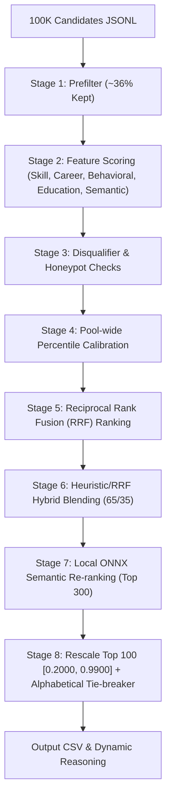

# 🏆 AI Candidate Ranking Intelligence

A production-grade, high-fidelity candidate discovery and ranking engine designed for the **Intelligent Candidate Discovery & Ranking Challenge** (India Runs Data & AI Challenge). It processes, filters, and ranks **100,000+** candidate profiles, producing an optimized shortlist of the **top 100** candidates for a **Senior AI Engineer** role in less than **4 minutes** entirely offline on CPU.

---

## 🚀 Key Architectural Pillars

### 1. ColBERT-style MaxSim Semantic Similarity
Rather than concatenating a candidate's entire resume into a single string (which dilutes specialized technical search queries with boilerplate resume terms), the engine uses a **late-interaction MaxSim** matcher:
* **Query Segmentation**: The Job Description is divided into **5 Core JD Areas** (Retrieval & Search, Vector Databases, Evaluation & Ranking, LLM Fine-Tuning, and MLOps/Systems).
* **Profile Segmentation**: Candidate profiles are parsed into 3 distinct logical segments:
  1. *Headline, Summary, and Current Title*
  2. *Skills*
  3. *Career History Roles* (individual role titles and descriptions evaluated independently)
* **Late-Interaction Score**: For each Core JD Area, the engine computes the maximum similarity across all candidate segments, then takes a weighted average of these maximum values:
  $$\text{Semantic Similarity} = \sum_{a \in \text{Core Areas}} \text{Weight}_a \times \max_{s \in \text{Segments}} \left( \text{CosineSim}(a, s) \right)$$

### 2. Reciprocal Rank Fusion (RRF) Calibration
To increase robustness against variations in dataset distributions and metric scales, the engine employs a dual-channel rank blending system:
* **Percentile Calibration**: Calibrates raw scores (Skill, Career, Semantic, Education, Behavioral) to percentiles pool-wide.
* **RRF Scoring**: Candidates are ranked independently across the 5 dimensions. An RRF score is computed using:
  $$\text{RRF Score}(c) = \sum_{d \in \text{Dimensions}} \frac{\text{Weight}_d}{k + \text{Rank}_d(c)}$$
  *(where $k = 60$ and $\text{Weight}_d$ is the dimension weight).*
* **Hybrid Blend**: Blends the heuristic composite score (65%) with the RRF score (35%) to generate the final rank.

### 3. Softened Career Disqualifications
To prevent false-positive drops of experienced AI engineers with mixed career histories:
* **Conditional Exclusions**: Candidates are only hard-disqualified if **100% of their career history** is consulting-only *and* their **current/latest role** is at a consulting firm.
* **Proportional Soft Decay**: Candidates with mixed experience (historical consulting roles, but now in product engineering) receive a soft penalty deduction proportional to their career tenure:
  $$\text{Soft Deduction} = 0.30 \times \frac{\text{Consulting Roles}}{\text{Total Roles}}$$

### 4. Offline Stage-2 Semantic Re-ranking
* **Stage-1 Prefilter**: A regex filter keeps only candidates showing relevant AI/ML keywords in their title, summary, skills, or career history, filtering out ~64% of noisy profiles.
* **Stage-2 Re-ranking**: The top 300 candidates undergo high-fidelity re-ranking using a local ONNX `all-MiniLM-L6-v2` encoder model.
* **Sandbox Safety**: Thread limits are constrained (`intra_op_num_threads = 1` and `inter_op_num_threads = 1`) to run safely in CPU-bound sandboxes without memory leaks.

---

## 📈 System Flow



---

## 🛠️ Quick Start

### 1. Installation

```bash
pip install -r requirements.txt
```

### 2. Dataset Setup
Download `candidates.jsonl` from the challenge portal and place it in the nested path:
```
[PUB] India_runs_data_and_ai_challenge/[PUB] India_runs_data_and_ai_challenge/India_runs_data_and_ai_challenge/candidates.jsonl
```

### 3. Generate Submission CSV

```bash
python rank.py --candidates "./[PUB] India_runs_data_and_ai_challenge/[PUB] India_runs_data_and_ai_challenge/India_runs_data_and_ai_challenge/candidates.jsonl" --out team_sandeep.csv
```

### 4. Validate Submission

```bash
python "./[PUB] India_runs_data_and_ai_challenge/[PUB] India_runs_data_and_ai_challenge/India_runs_data_and_ai_challenge/validate_submission.py" team_sandeep.csv
```

---

## 🖥️ Web Dashboard

Start the Flask dashboard:
```bash
python app.py
```
Open **[http://127.0.0.1:5000](http://127.0.0.1:5000)** in your browser to inspect candidate lists, view radar-chart breakdowns of top matches, and run real-time validations.

---

## 🧪 Running Tests

Execute the test suite to verify scoring calibration, GPA parsing, career trajectory models, and semantic similarity:
```bash
python -m unittest tests/test_scoring.py -v
```

---

## 📂 Project Structure

```text
rank.py                  # CLI pipeline entry point
app.py                   # Flask dashboard (Render-ready port bindings)
config.py                # Weights, skill taxonomy, aliases, JD constants
Procfile                 # Production server deployment directives
models/                  # Offline model weights (Tokenizer.json, model.onnx)
scoring/
  skill_matcher.py       # Custom skill clustering & proficiency scoring
  career_scorer.py       # Trajectory, company tiers, & job-hopping penalties
  behavioral_scorer.py   # Multi-signal engagement & responsiveness analyzer
  semantic_scorer.py     # Stage-1 TF-IDF document similarity
  semantic_similarity.py # MaxSim late-interaction TF-IDF & ONNX vectors
  disqualifier.py        # Consulting soft decays & MUST-HAVE requirements
  honeypot_detector.py   # Detection for fabricated candidate profiles
  composite.py           # Feature aggregator & multiplier clamps
  reasoning.py           # Deterministic recruiter summary generator
tests/test_scoring.py    # Complete unit test coverage
```

---

## ☁️ Deployment

The project is pre-configured for web deployments (e.g., Render or Railway) using `gunicorn`:
```bash
gunicorn app:app --bind 0.0.0.0:$PORT --workers 1 --threads 4 --timeout 120
```
This is managed dynamically via the included `Procfile`.
