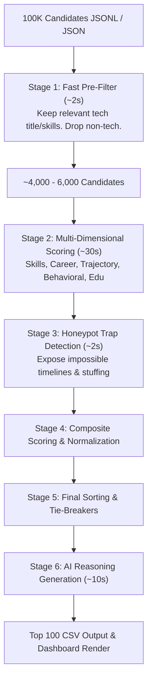

# Redrob AI Recruitment Intelligence

An elite AI-powered candidate evaluation and ranking engine designed for the **India Runs Data & AI Challenge**. The system filters, scores, and shortlists the **top 100 candidates** from a pool of **100,000+ profiles** for a **Senior AI Engineer** role, executing within a strict compute constraint (CPU-only, <16GB RAM) and avoiding complex impossible trap profiles (honeypots).

---

## 🚀 Architecture Overview (The Pipeline Funnel)

To rank 100K profiles within a 5-minute CPU budget, the pipeline operates as a memory-efficient multi-stage funnel:



---

## 🛠️ Components & Scoring Dimensions

### 1. Semantic Skill Matcher (`scoring/skill_matcher.py`)
* **Semantic Clusters:** Groups skills canonicalized through an extensive list of aliases (e.g. `SBERT` $\rightarrow$ `sentence-transformers`, `GenAI` $\rightarrow$ `large language models`).
* **Evaluation:** Scores Must-Haves (Embeddings, Vector Databases, Python, Ranking Evaluation) and Nice-to-Haves (Fine-tuning, Learning-to-Rank, MLOps, Distributed Systems).
* **Adjusters:** Applies multipliers for expertise proficiency, durations, endorsements count, and Redrob skill assessment scores.

### 2. Career Scorer & Trajectory (`scoring/career_scorer.py`)
* **Title Tiers:** Matches titles to Tiers 1-5 (Tier 1 AI/ML Engineer $\rightarrow$ Tier 5 Non-Tech).
* **Industry & Domain:** Prioritizes product company backgrounds. Applies a **penalty (-10.0)** for candidates whose entire career is spent at consulting IT service companies (TCS, Infosys, Wipro, Accenture, etc.).
* **Shipment Signals:** Searches description text for production deployment signals (e.g., `production`, `shipped`, `scale`, `latency`, `latency`, `throughput`).
* **Hopping Check:** Penalizes job-hoppers with an average tenure of under 18–24 months.

### 3. Behavioral Scorer (`scoring/behavioral_scorer.py`)
* **Engagement Signals:** Evaluates candidate response rate, response times, profile completeness, open-to-work flag, interview completion rate, notice period, and location (relocation or residency in India).
* **Multiplier:** Outputs a combined multiplier clamped between `[0.3, 1.5]` that scales the candidate's final ranking.

### 4. Honeypot Trap Detector (`scoring/honeypot_detector.py`)
* **Checks:** Catches impossible timeline signals, such as claiming 8 years tenure at a 3-year-old company, claiming 10+ expert skills with 0 months duration, graduation year after career start, or expert proficiency claims backed by poor test scores (<30).
* **Action:** Flags honeypots and instantly zeros out their composite score to exclude them from the shortlist.

### 5. Composite Scoring & Tie-Breaks (`scoring/composite.py`)
* **Composite Weighting:** Combines dimensions: `Skill Match (35%)`, `Career & Trajectory (40%)`, `Behavioral Score (15%)`, `Education & Certifications (10%)`.
* **Tie-Breaker:** In case of equal scores, ranks candidates alphabetically by `candidate_id` in ascending order (per competition rules).

### 6. AI Reasoning Synopsis (`scoring/reasoning.py`)
* **Dynamic Generation:** Produces unique, non-templated candidate summaries connecting candidate achievements/gaps directly to the JD requirements.

---

## 💻 Web Dashboard Features

The web frontend is a single-page SaaS dashboard built using HTML5, Vanilla JavaScript, and responsive CSS (glassmorphic dark theme):

* **Interactive Hero:** Ambient mesh floating orb background and gradient animations.
* **Dynamic JD Analysis:** Collapsible details card rendering core role criteria dynamically from the config.
* **Stopwatch Timer:** Tracks evaluation elapsed time down to the second in real time during execution.
* **Real-time Streaming:** Establishes Server-Sent Events (SSE) mapping progress fills, active stages, and processed numbers.
* **Rankings Table:** Alternating translucent rows, custom badge medals for Ranks 1-3, colored verdict badges (Strong Yes, Yes, Maybe, Honeypot), and animated score bars.
* **Search Filter:** A debounced client-side filter to query candidate profiles by name, title, or skills instantly.
* **Details Side Panel / Modal:** Renders the candidate breakdown scores and builds a **vertical career timeline** showing durations, company logs, and descriptions.
* **Custom Dataset Upload:** A file selector to upload, count, and evaluate any custom candidate JSON or JSONL file.
* **Output Verification:** Runs `validate_submission.py` checks and renders a checklist of results.
* **CSV Export:** Downloads the formatted spreadsheet in one click.

---

## 🏃 How to Run the Project

### 1. Local Web Dashboard
1. Install dependencies:
   ```bash
   pip install -r requirements.txt
   ```
2. Start the Flask server:
   ```bash
   python app.py
   ```
3. Open your browser and navigate to:
   ```
   http://127.0.0.1:5000
   ```

### 2. Command Line Pipeline
To run the evaluation CLI tool directly:
```bash
python rank.py --candidates <path_to_dataset> --out <path_to_output_csv>

# Example (Running sample dataset):
python rank.py --candidates "./[PUB] India_runs_data_and_ai_challenge/[PUB] India_runs_data_and_ai_challenge/India_runs_data_and_ai_challenge/sample_candidates.json" --out submission.csv
```

---

## ☁️ Deployment (Ready for Render)

This project is fully pre-configured to deploy on [Render.com](https://render.com/) or [Railway.app](https://railway.app/):

* **Gunicorn Production Server:** Added to `requirements.txt` to handle multi-threaded requests and long processing times.
* **Procfile:** Configured with worker limits and a 120s timeout extension (`web: gunicorn app:app --workers 1 --threads 4 --timeout 120`).
* **.gitignore:** Prevents committing large candidate datasets (which exceed GitHub push limits) and local pycache files.
