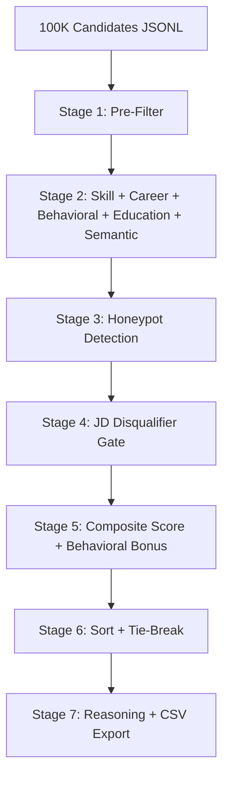

# Redrob AI — Candidate Ranking Intelligence

Hybrid recruiter ranking engine for the **India Runs Data & AI Challenge**. Filters, scores, and shortlists the **top 100** candidates from **100,000+** profiles for a **Senior AI Engineer** role — CPU-only, &lt;16GB RAM, &lt;5 min, with honeypot detection and JD disqualifier gates.

---

## What's New (Hackathon-Ready & Optimized)

- **Phase 3 Kaggle Grandmaster Optimizations** — Complete defensive programming against `NoneType` and structure failures, canonical skill alias expansion (e.g. `retrieval systems`, `experiment tracking`), and tightened prefilter keyword targeting.
- **JD disqualifier gate** — hard/soft penalties for consulting-only, non-tech stuffers, CV-without-NLP, no production signals.
- **Semantic JD fit scorer** — narrative alignment without GPU or network.
- **7-check honeypot detector** — expanded trap detection using full config taxonomy.
- **Title-tier skill weighting** — Civil Engineer / HR Manager cannot rank on keywords alone.
- **Evidence-linked reasoning** — Verdict + Strengths + Risks (no false "Exceptional fit").
- **Submission kit** — `submission_metadata.yaml`, `scripts/run_submission.*`, `docs/APPROACH.md` (convert to PDF).

---

## Architecture



### Scoring Weights

| Dimension | Weight |
|-----------|--------|
| Skill clusters | 30% |
| Career & trajectory | 35% |
| Semantic JD fit | 15% |
| Behavioral | 12% |
| Education | 8% |

---

## Quick Start

### 1. Install

```bash
pip install -r requirements.txt
```

### 2. Dataset Setup

Download `candidates.jsonl` from the challenge portal and place it in the challenge root directory:

```
[PUB] India_runs_data_and_ai_challenge/[PUB] India_runs_data_and_ai_challenge/India_runs_data_and_ai_challenge/candidates.jsonl
```

### 3. Generate Submission

```bash
# Windows (PowerShell)
python rank.py --candidates "./[PUB] India_runs_data_and_ai_challenge/[PUB] India_runs_data_and_ai_challenge/India_runs_data_and_ai_challenge/candidates.jsonl" --out team_antigravity.csv

# Directly run pipeline and output to project root
python rank.py --candidates [path_to_jsonl] --out team_antigravity.csv
```

### 4. Validate

```bash
python "./[PUB] India_runs_data_and_ai_challenge/[PUB] India_runs_data_and_ai_challenge/India_runs_data_and_ai_challenge/validate_submission.py" team_antigravity.csv
```

### 5. Web Dashboard

```bash
python app.py
# Open http://127.0.0.1:5000
```

---

## Submission Checklist

- [x] `team_antigravity.csv` — 100 rows, validated successfully (`Submission is valid.`)
- [x] `docs/APPROACH.md` — document detailing the hybrid ranking approach and design decisions
- [x] `submission_metadata.yaml` — configured with team name, repo, sandbox URL, and reproduce command
- [x] Web dashboard running locally and deployable to Render/Railway
- [x] Public GitHub repository containing clean, optimized codebase without duplicate files

---

## Project Structure

```
rank.py                  # CLI entry point
app.py                   # Flask dashboard
config.py                # JD taxonomy, weights, aliases
scoring/
  skill_matcher.py       # Cluster-based skill scoring
  career_scorer.py       # Career trajectory + production signals
  behavioral_scorer.py   # Platform engagement signals
  semantic_scorer.py     # JD narrative fit
  disqualifier.py        # JD hard/soft gates
  honeypot_detector.py   # Fabricated profile detection
  composite.py           # Weighted aggregation
  reasoning.py           # Recruiter reasoning strings
tests/test_scoring.py    # Unit tests
docs/APPROACH.md         # Deck (convert to PDF)
submission_metadata.yaml # Portal metadata
```

---

## Tests

```bash
python -m unittest tests.test_scoring -v
```

---

## Deployment

```bash
gunicorn app:app --workers 1 --threads 4 --timeout 120
```

See `Procfile` for Render/Railway.

---

## Design Decisions

| Decision | Rationale |
|----------|-----------|
| Hybrid rules + semantic overlap | Meets CPU/RAM constraints; interpretable + better than pure keywords |
| Title-tier skill multiplier | Stops non-tech keyword stuffers reaching top 100 |
| Disqualifier gate before composite | Enforces JD hard requirements like a recruiter |
| Deterministic reasoning | Reproducible submissions across runs |
| Streaming JSONL | Memory-efficient for 100K profiles |
